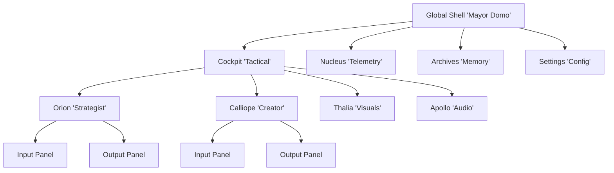

# Dashboard V3 "Glass Cockpit" - UX Architecture & Flow Spec (V2)

## 1. High-Level Architecture (Sitemap)

The Dashboard is a "Living Organism" interface. It does not just display data; it breathes, pulses, and reacts.

---

## 2. Visual Specification (The "Glass" Aesthetic)

### Color Code System (State Indicators)
Every Agent and Component must adhere to these state colors for LEDs, borders, and text.

| State | Color Token | Hex | Animation | Behavior |
| :--- | :--- | :--- | :--- | :--- |
| **OFFLINE / NULL** | `slate-800` | `#1e293b` | Static | Dimmed, non-interactive |
| **IDLE / READY** | `slate-400` | `#94a3b8` | Static | Waiting for input |
| **ACTIVE / INPUT** | `blue-500` | `#3b82f6` | Pulse (Slow) | User is typing or configuring |
| **PROCESSING** | `purple-500` | `#a855f7` | Shaking / Vibration | Neural network active / "Thinking" |
| **WARNING** | `amber-500` | `#f59e0b` | Blink (1Hz) | Low confidence / Missing params |
| **ERROR / HALTED** | `red-500` | `#ef4444` | Strobe (Fast) | Loop detected / API Failure |
| **SUCCESS / OPTIMAL** | `emerald-500` | `#10b981` | Glow (Steady) | Task complete / Assets ready |

---

## 3. Global Shell (The "Mayor Domo")

### A. Identity Block
*   **Logo**: AXON Icon (Glitching effect on hover).
*   **Label**: `Daria's Personal AI "Mayor Domo"`.
*   **Version**: `v3.0.0 Glass Cockpit`.

### B. Session Intelligence Badge
Interactive pill displaying context awareness:
*   **User State**: `LOGGED IN` (Green Dot) or `GUEST MODE` (Yellow Dot).
*   **Temporal**: `HH:MM:SS` (Live) | `ZONE` (e.g., EST).
*   **Session ID**: `SESS-XXXX` (Click to copy).

### C. Active Brain Dock (Agent Array)
One LED indicator for *every* agent in the mesh.
*   **Orion**: 🔵 Blue (Strategy)
*   **Calliope**: 🟣 Purple (Copy)
*   **Thalia**: 🟠 Orange (Image)
*   **Apollo**: 🔴 Red (Audio)
*   **ECHO**: ⚪ White (Reflection/Memory)

*Behavior*: LED changes color matches the **Color Code System** above based on real-time state.

### D. Control Cluster
*   **Wallet**: Live Dollar Cost (e.g., `$0.0423`). Turns **RED** text if session cost > $1.00.
*   **Kill Switch (Emergency Reset)**:
    *   **Visibility**: Visible on Error or Hover.
    *   **Action**: Click -> **"Confirm Emergency Reset?"** Modal.
    *   **Logic**:
        *   **Soft Reset**: Reverts specific Agent to *Initial Parameters* and retries task.
        *   **Hard Reset**: Reloads OS, clears state, regenerates Session ID.

---

## 4. Orion Module ("The Strategist")

### A. Input Panel (Parameters)
Becomes active loop when user engages.
*   **`Company Name`**: Text Field.
*   **`Channel Name`**: Text Field.
*   **`Objective`**: Dropdown [`Monetize`, `Interaction`, `Subscribers`, `Survey`, `Promotion`, `Brand Awareness`].
*   **`Content Type`**: Dropdown [`Video`, `Short`, `Script`, `Photo`, `Carousel`, `Thread`].
*   **`Video Duration`**: Slider/Select [`Very Short (<15s)`, `Short (15-60s)`, `Medium (1-3m)`, `Long (3-10m)`, `Very Long (>10m)`].
*   **`Matrix Input`**: Keywords tags.
*   **`Tone Dial`**: Knob for personality.
*   **`Platform`**: Grid selection.

### B. Process State ("The Neural Ring")
*   **Trigger**: Button `EXECUTE STRATEGY`.
*   **Visual**: Module shakes/vibrates gently. Neural Ring pulses Purple/Blue.
*   **Telemetry**: Live text stream updating dynamic tasks (e.g., *"Analyzing Competitors...", "Simulating Virality..."*).

### C. Output Panel (Manifest Deck)
*   **Action**: Automatically switches to this panel upon SUCCESS.
*   **Virality Gauge**: Donut Chart (Color coded: Green > 8.0, Yellow > 5.0, Red < 5.0).
*   **Manifest Cards**: Editable objects. User can click to edit text, copy JSON, or "Reject".
*   **Handoff**:
    *   **System Action**: Populates partial Manifest fields in Calliope's Input (others typically remain `null` pending generation).
    *   **Status**: Orion LED turns **Green**.

---

## 5. Calliope Module ("The Creator")

### A. Input Panel (Refinement)
*   **Source**: Auto-populated from Orion Manifest (Target Audience, Tone, Key Points).
*   **Refinement Fields**:
    *   `Language Style`: Simple, Academic, Slang.
    *   `Focus`: Visuals vs. Dialogue.
*   **Auto-Run Logic**:
    *   Timer appears: "Auto-generating in 30s...".
    *   **Interruption**: Typing in any field pauses the timer.
    *   **Action**: If time expires OR user clicks `GENERATE SCRIPT` -> Process Start.

### B. Process State ("The Shimmer")
*   **Visual**: Shimmering glass effect over the panel. 
*   **Telemetry**: "Drafting Scene 1...", "Refining Hooks...".
*   **Color**: Pulsing **Purple**.

### C. Output Panel (The Workshop)
*   **View**: Split Pane (Storyboard Left | Editor Right).
*   **Objects**:
    *   **Scenes**: Editable cards.
    *   **Script**: Full Markdown editor.
*   **Timeline**: Progress bar at bottom showing duration.
*   **Actions**: `Copy to Clipboard`, `Send to Thalia` (for Visuals), `Export PDF`.

---

## 6. Nucleus Panel ("The Black Box")

### Live Trace Stream
*   **Rows**: Real-time event log.
*   **Columns**:
    *   `TIMESTAMP`: ISO format (Dimmed).
    *   `TRACE ID`: Hash (Clickable).
    *   `AGENT`: Name + Color Badge.
    *   `ACTION`: Verb (e.g., `PROCESS_START`, `DETECT_LOOP`).
    *   `LABEL`: Human-readable status (labeled).
*   **Interaction**: Click row to expand full JSON payload side-panel.

---

## 7. Error & Emergency Flows

### A. The "Hallucination" Loop
*   **Detection**: System detects circular logic or >60s timeout.
*   **Visual**: Agent Module borders flash **RED**. LED strokes fast. Note: "Instability Detected".
*   **User Action**: Click **RESET** (Kill Switch).

### B. Restoration Logic (The "Time Travel")
*   *Upon Reset Confirmation:*
    *   **Target Agent**: Reverts to `active_task: null`.
    *   **Memory**: Loads *Initial Parameters* (Snapshot taken at start).
    *   **Action**: Retries the task automatically (Imitating original state).
    *   **System**: Other agents remain unaffected (Preserve State).

---

## 8. Missing Flows / Future Expansion

### A. Settings & Configuration
*   **Global Variables**: Panel to specific "Wealth Goals" ($/RPM), Brand Voices, API Keys.
*   **Agent Profiles**: Individual "Personality" sliders for each agent.

### B. Archives (Memory Bank)
*   **Session History**: List of past `SESS-ID`s.
*   **Asset Library**: Gallery of all generated Scripts, Images, Manifests.
    *   Searchable by "Keyword", "Date", "Agent".

