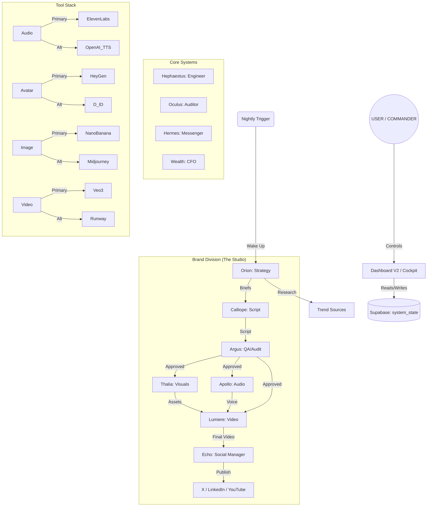

# SYSTEM ORGANIGRAM (Visual Structure)

## Workflow Legend
1.  **Research**: Nightly Scan -> Orion creates Strategy.
2.  **Creation**: Calliope drafts -> Thalia/Apollo/Lumiere generate assets.
3.  **Audit**: Argus verifies Safety & Quality.
4.  **Distribution**: Echo publishes to mapped channels.
5.  **Correction**: Oculus monitors health -> Hephaestus fixes code.
